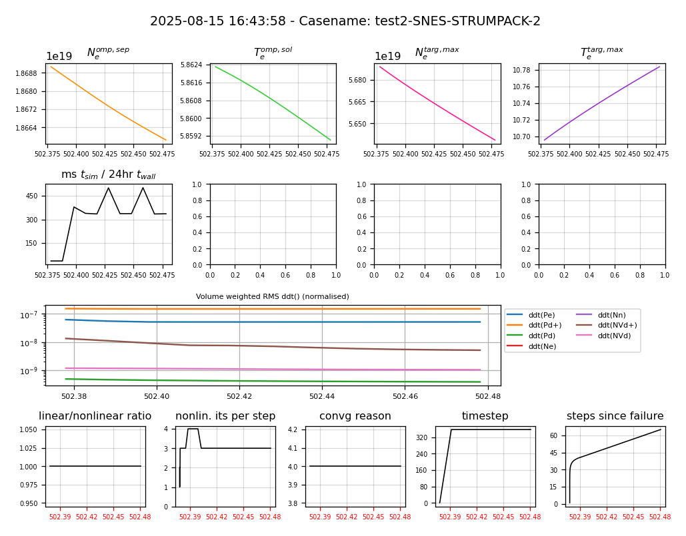

# Intro
This repo has standardised performance test cases for Hermes-3.

# Running tests
Hermes-3 needs the input (BOUT.inp) and restart files (BOUT.restart.*.nc) to run each test. The restart files are provided in the `base` subdirectory of each test. To reset the test, just copy the restart files into the case directory. Grid files need to be in the same directory that you run Hermes-3 in, so you can run the tests from the root dir.

Run command:

```
mpirun -np 10 hermes_dir/hermes-3 -d test1 restart
```

The console output will look like this. The first line is the BOUT++ output for an output time step.
Lines beginning with "Time: " are a hacky way to get SNES diagnostics per solver timestep. These are later parsed from the log file and plotted.

```
Sim Time  |  RHS evals  | Wall Time |  Calc    Inv   Comm    I/O   SOLVER

1.787e+07          1       5.17e-02     3.2    0.0    0.5  149.2  -52.9
Time: 17865419.88100062, timestep: 0.001, nl iter: 1, lin iter: 1, reason: 3
Time: 17865419.882000618, timestep: 0.001, nl iter: 1, lin iter: 1, reason: 4
Time: 17865419.883000616, timestep: 0.001, nl iter: 1, lin iter: 1, reason: 4
Time: 17865419.884400617, timestep: 0.0014, nl iter: 1, lin iter: 2, reason: 4
Time: 17865419.886360615, timestep: 0.00196, nl iter: 1, lin iter: 3, reason: 4
Time: 17865419.889104616, timestep: 0.002744, nl iter: 1, lin iter: 3, reason: 4
Time: 17865419.892946217, timestep: 0.0038415999999999997, nl iter: 1, lin iter: 4, reason: 4
Time: 17865419.898324456, timestep: 0.005378239999999999, nl iter: 1, lin iter: 1, reason: 4
Time: 17865419.90585399, timestep: 0.007529535999999999, nl iter: 1, lin iter: 3, reason: 4
Time: 17865419.91639534, timestep: 0.010541350399999998, nl iter: 1, lin iter: 4, reason: 4
Time: 17865419.93115323, timestep: 0.014757890559999997, nl iter: 1, lin iter: 5, reason: 4
Time: 17865419.95181428, timestep: 0.020661046783999996, nl iter: 1, lin iter: 1, reason: 4
Time: 17865419.980739746, timestep: 0.028925465497599993, nl iter: 1, lin iter: 4, reason: 4
```

## Hermes-3 and BOUT++ version requirements
At the moment, you need to use commit d1cf522 (https://github.com/boutproject/hermes-3/pull/388)

## Post-processing
This repo includes M. Kryjak's personal post-processing script repo `sdtools`. The cases can be post-processed using the `cmonitor.py` tool:

```
cmonitor.py -s -solverdiags test1
```

Outputs from running this on M. Kryjak's machine are included in the repo. In the plots, the top row shows the evolution of physical quantities. The second row shows simulation speed in ms of simulation time per 24hrs of wall time. The third row shows the RMS of the LHS of the equations, i.e. ddt(Ne) etc. These plots show you which quantities are varying the most. The final row is parsed from the log file and contains the SNES diagnostics. These are on a solver timestep basis while the rest of the plot is on an output timestep basis - note that these are not necessarily the same, as the solver timesteps are taken from the log file which is overwritten per run, while the output time comes from the dataset.

Note on convergence reason nomenclature:
2 - atol
3 - rtol
4 - stol
5 - iteration limit

## Resetting the test
You can use another tool from `sdtools` to reset the test, which copies the restart files from the baseline directory:

```
transplant.py test1/base test1
```

# Test cases

## Test 1
Based on a simplified, steady state low power solution based on the ST40 tokamak (see Kryjak @ APS 2023). 
This test restarts from the baseline with x1.5 power and runs 10 output timesteps of 0.005ms each.

- Runs for 10 output timesteps of 0.2ms each.
- Needs 10 cores to run.
- Original case ID: p2d3ab-power_x1.5
- Original grid ID: g3e4-lores_widev2_nonortho_xpoint.nc

Known performance on M. Kryjak's machine (see solver settings section):
 - SNES-1 settings: 5m 3s (~550 ms/24hrs)

### Performance with SNES-1


## Test 2
Based on the full, unsimplified version of Test 1. It's a lot more computationally intensive than Test 1 
and is on the critical path for the SOLPS comparison project. The test restarts from a steady state solution
with a lower neutral pump albedo, which leads to the reduction of plasma density. A strange and potentially worrying fact is that the convergence reason is nearly always 4, which suggests it's not reaching atol/rtol.

- Runs for 10 output timesteps of 0.01ms each. (20x less than Test 1)
- Needs 10 cores to run.
- Original case ID: upst1ad-malamas_settings_tune
- Original grid ID: g3e4f1-lores_widev2_nonortho_xpoint_allf.nc

Known performance on M. Kryjak's machine:
 - SNES-1 settings: 4m 44s (~30 ms/24hrs)
 - SNES-STRUMPACK-2 settings: 45s

### Performance with SNES-1


### Performance with SNES-STRUMPACK-2



## Test 3
Based on DIII-D. Relevant to M. Tsagkiridis' project. It's a very challenging
test because it's nearly from scratch, so everything is changing. Needs 10 cores to run.

Known performance on M. Kryjak's machine:
 - SNES-1 settings: 3m 11s  (~8 ms/24hrs)

### Performance with SNES-1


## PETSc configuration
To enable STRUMPACK, use the following configure flags for PETSc:

```
./configure --with-mpi=yes --download-hypre --download-make --with-fortran-bindings=0 --with-debugging=0 --download-strumpack --download-metis --download-parmetis --download-ptscotch --download-zfp --download-scalapack
```

Note that you will need to have `flex` and `bison` installed for `ptscotch` which is a STRUMPACK dependency. These are additional to the usual dependency list in the Hermes-3 documentation

# Solver settings

## CVODE-1
Standard CVODE settings:

```
[solver]
mxstep = 1e9
cvode_max_order = 3
maxl = 5
atol = 1e-12 * 1
rtol = 1e-6 * 1
use_precon = True
diagnose = false
```

## SNES-1
Settings using the latest Hypre ILU (needs PETSc >=3.23.3) with Malamas Tsagkiridis' PID timestepper:

```
[solver]
diagnose = true
type = snes                      # Backward Euler steady-state solver
snes_type = newtonls             # Nonlinear solver
ksp_type = gmres                 # Linear solver: gmres, cg
max_nonlinear_iterations = 16    # default: 50
pc_type = hypre                  # Preconditioner type
pc_hypre_type = ilu         
lag_jacobian = 7                 # Iterations between jacobian recalculations. default: 50
atol = 1e-12                      # Absolute tolerance
rtol = 1e-6                      # Relative tolerance
stol = 1e-12
maxf = 20000
maxl = 260
pidController = true
target_its = 5
kP = 0.65
kI = 0.30
kD = 0.15
matrix_free_operator = true
timestep = 0.001                 # Initial timestep

[petsc]

#log_view = true
                                    
pc_hypre_ilu_level = 1                            # k = 2  (default is 0, try 1 and 2)
pc_hypre_ilu_local_reordering = true              # reduces fill / improves robustness
pc_hypre_ilu_tri_solve = true                     # use triangular solve instead of smoothing
pc_hypre_ilu_print_level = true
snes_fd_color_use_mat = true
```

## SNES-STRUMPACK-1
Example STRUMPACK settings with STRUMPACK as direct solver:

```
[solver]
diagnose = true
type = snes                     # Backward Euler steady-state solver
snes_type = newtonls            # Nonlinear solver
ksp_type = preonly              # Linear solver
use_precon = false
max_nonlinear_iterations = 15   # default: 50
pc_type = lu                    # Preconditioner type
lag_jacobian = 500              # Iterations between jacobian recalculations. default: 50
atol = 1e-12                    # Absolute tolerance
rtol = 1e-6                     # Relative tolerance
stol = 1e-12
maxl = 20                       # default: 20
use_coloring = true
matrix_free_operator = true

[petsc]
pc_factor_mat_solver_type = strumpack
mat_strumpack_verbose = true
```

# Suggested solver settings from ChatGPT

## SNES-ASM-1

From ChatGPT:

- Replaces Hypre-ILU with ASM + ILU(k) to make each local problem “easier”.
- Cuts lag_jacobian from 6 → 2 for a stronger, more current Pmat.
- Switches gmres → fgmres for changing PCs.
- Removes all pc_hypre_* (conflicts) and adds reordering/diagonal options that help ILU stability.

ASM (Additive Schwarz Method) splits the global problem into overlapping subdomains, solves each locally (e.g., with ILU), and combines the results to precondition the whole system. For anisotropic problems like your SOL equations, this reduces the impact of long-range couplings, makes ILU more stable, and lets information travel across the grid via overlap, which you can tune for better performance.

FGMRES (Flexible GMRES) is a Krylov solver like GMRES but designed for cases where the preconditioner changes between iterations, as happens when you lag the Jacobian or rebuild ILU factors periodically. It maintains stability and convergence in these situations with only minor extra cost.

```
[solver]
diagnose = true
type = snes                                # Use PETSc's nonlinear solver (SNES).
snes_type = newtonls                       # Newton with line search (robust default).
ksp_type = fgmres                          # Flexible GMRES: safer when the PC changes (we lag/rebuild Pmat).
pc_type = asm                              # Additive Schwarz domain decomposition (wraps a stronger local solve).
matrix_free_operator = true                # J*v via MFFD (cheap); we still assemble a Pmat for the PC.
lag_jacobian = 2                           # Rebuild the Pmat every 2 Newton steps (was 6 in your file; stronger).
max_nonlinear_iterations = 16              # Safety cap on Newton iterations.
atol = 1e-12                               # Nonlinear abs tol (tight).
rtol = 1e-6                                # Nonlinear relative tol (typical).
stol = 1e-12                               # Step-norm tol (kept tight).
maxf = 2000                                # Max function evals (safety).
maxl = 260                                 # Max Krylov length (upper bound; FGMRES restarts internally if set).
timestep = 0.001                           # Your initial Δt; PID below will adapt it.

# Nonlinear time-step PID controller (keep; just retune target_its for new PC strength)
pidController = true
target_its = 8                             # Aim KSP ~8 iters; adjust after a test (e.g., 6–12).
kP = 0.65                                  # Proportional gain
kI = 0.30                                  # Integral gain
kD = 0.15                                  # Derivative gain

[petsc]
# Monitors (turn off once you're happy)
# snes_monitor = true                        # Print Newton residuals each iteration.
# ksp_monitor_true_residual = true           # Print true linear residuals each linear solve.
# snes_converged_reason = true               # Report why Newton stopped.
# ksp_converged_reason = true                # Report why KSP stopped.

# Additive Schwarz options
pc_asm_overlap = 2                         # Overlap between subdomains; try 2–4. More overlap helps anisotropy.

# Subdomain (local) solver used inside ASM
sub_ksp_type = preonly                     # Just apply the preconditioner; no inner Krylov.
sub_pc_type = ilu                          # Local ILU(k) factorization per subdomain.
sub_pc_factor_levels = 2                   # ILU(k): k=2 is stronger than ILU(0/1); watch memory, try 1–4.
sub_pc_factor_mat_ordering_type = rcm      # Reorder to reduce fill/zero pivots (try rcm vs nd).
sub_pc_factor_nonzeros_along_diagonal = true  # Improves stability for ILU on tough matrices.

# Don’t oversolve early Newton steps; lets KSP stop earlier when far from solution
snes_ksp_ew = true
```

## SNES-STRUMPACK-2

- This keeps the matrix-free operator, but the Pmat is assembled and factored by STRUMPACK.
- Turning on mat_strumpack_compression trades a bit of factor accuracy for speed/memory — test both on/off.
- If memory is fine and you want max robustness, leave compression off.

```
[solver]
diagnose = true
type = snes
snes_type = newtonls   # newtontr not as good
ksp_type = fgmres
pc_type = ilu
max_nonlinear_iterations = 16
atol = 1e-12
rtol = 1e-6
stol = 1e-14
maxf = 2000
maxl = 260
matrix_free_operator = false
lag_jacobian = 1
timestep = 0.001

pidController = true
target_its = 6
kP = 0.65
kI = 0.3 # 0.30
kD = 0.15 # 0.15

[petsc]
# snes_monitor
# ksp_monitor_true_residual
#snes_converged_reason = false
#ksp_converged_reason = false

# STRUMPACK as factorization backend for ILU/LU
pc_factor_mat_solver_type = strumpack

# snes_linesearch_type = bt
# snes_linesearch_damping = 0.6     # 0.5–0.7 is a good band
# snes_linesearch_minlambda = 1e-4

# (Try one at a time; comment the others)
mat_strumpack_reordering = metis      # or rcm, amd; pick the best
# mat_strumpack_compression = blr      # if built with BLR/HSS; enables faster approx factors
# mat_strumpack_compression = hss

snes_ksp_ew = true
```