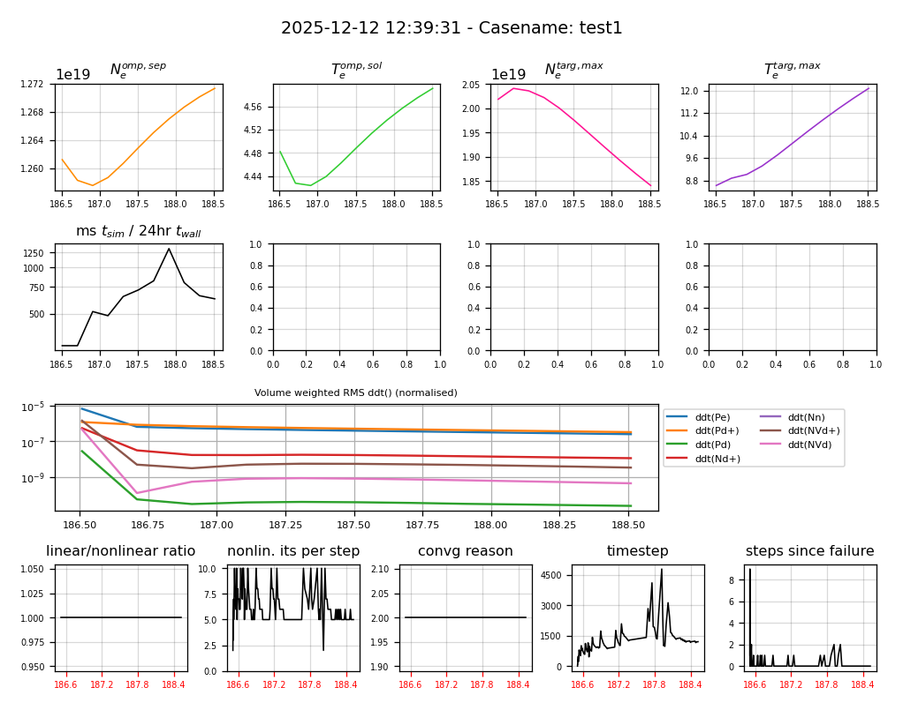
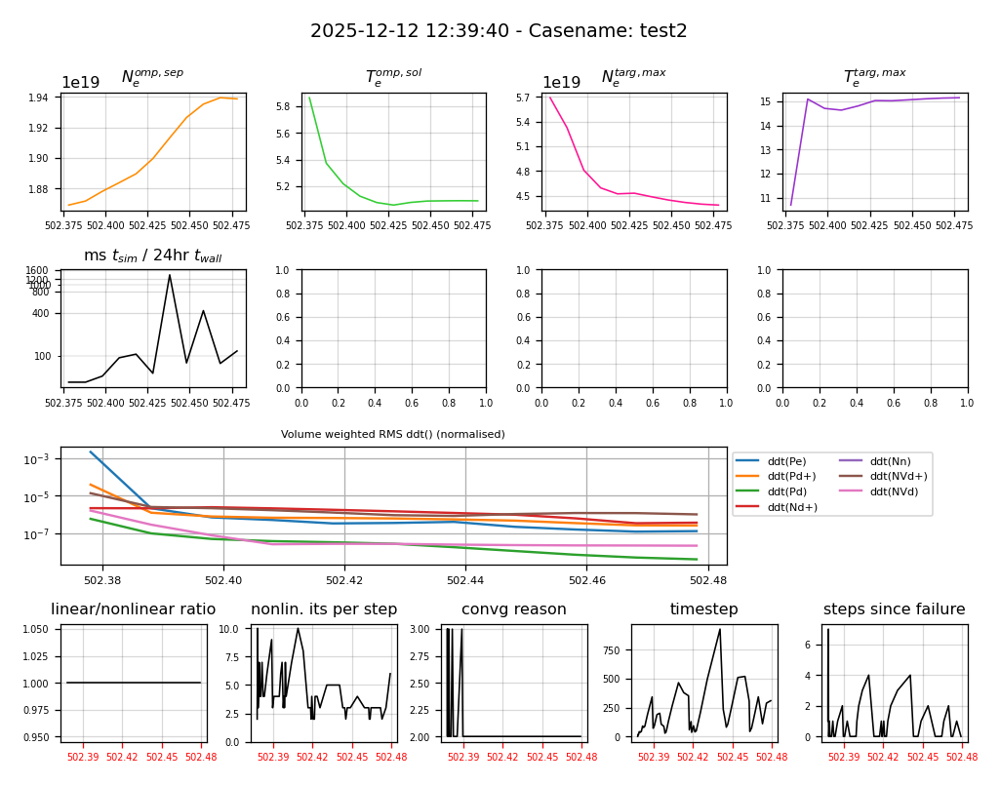
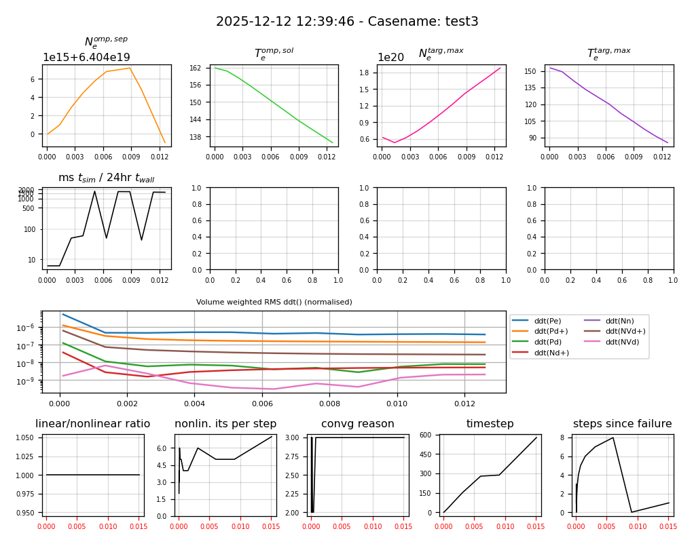

# Intro
This repo has standardised performance test cases for Hermes-3.

# Running tests
Hermes-3 needs the input (BOUT.inp) and restart files (BOUT.restart.*.nc) to run each test. The restart files are provided in the `base` subdirectory of each test. To reset the test, just copy the restart files into the case directory. Grid files need to be in the same directory that you run Hermes-3 in, so you can run the tests from the root dir.

Run command:

```
mpirun -np 10 hermes_dir/hermes-3 -d test1 restart
```

The console output will look like this. The first line is the BOUT++ output for an output time step.
Lines beginning with "Time: " are a hacky way to get SNES diagnostics per solver timestep. These are later parsed from the log file and plotted.

```
Sim Time  |  RHS evals  | Wall Time |  Calc    Inv   Comm    I/O   SOLVER

1.787e+07          1       5.17e-02     3.2    0.0    0.5  149.2  -52.9
Time: 17865419.88100062, timestep: 0.001, nl iter: 1, lin iter: 1, reason: 3
Time: 17865419.882000618, timestep: 0.001, nl iter: 1, lin iter: 1, reason: 4
Time: 17865419.883000616, timestep: 0.001, nl iter: 1, lin iter: 1, reason: 4
Time: 17865419.884400617, timestep: 0.0014, nl iter: 1, lin iter: 2, reason: 4
Time: 17865419.886360615, timestep: 0.00196, nl iter: 1, lin iter: 3, reason: 4
Time: 17865419.889104616, timestep: 0.002744, nl iter: 1, lin iter: 3, reason: 4
Time: 17865419.892946217, timestep: 0.0038415999999999997, nl iter: 1, lin iter: 4, reason: 4
Time: 17865419.898324456, timestep: 0.005378239999999999, nl iter: 1, lin iter: 1, reason: 4
Time: 17865419.90585399, timestep: 0.007529535999999999, nl iter: 1, lin iter: 3, reason: 4
Time: 17865419.91639534, timestep: 0.010541350399999998, nl iter: 1, lin iter: 4, reason: 4
Time: 17865419.93115323, timestep: 0.014757890559999997, nl iter: 1, lin iter: 5, reason: 4
Time: 17865419.95181428, timestep: 0.020661046783999996, nl iter: 1, lin iter: 1, reason: 4
Time: 17865419.980739746, timestep: 0.028925465497599993, nl iter: 1, lin iter: 4, reason: 4
```

## Hermes-3 and BOUT++ version requirements
Use the this Hermes-3 master commit: 8430ce75a0162d915e42fc8146e283fc87d1c866
Currently you need to use this BOUT++ version: https://github.com/boutproject/BOUT-dev/pull/3226

## Post-processing
This repo includes M. Kryjak's personal post-processing script repo `sdtools`. The cases can be post-processed using the `cmonitor.py` tool:

```
cmonitor.py -s -solverdiags test1
```

Outputs from running this on M. Kryjak's machine are included in the repo. In the plots, the top row shows the evolution of physical quantities. The second row shows simulation speed in ms of simulation time per 24hrs of wall time. The third row shows the RMS of the LHS of the equations, i.e. ddt(Ne) etc. These plots show you which quantities are varying the most. The final row is parsed from the log file and contains the SNES diagnostics. These are on a solver timestep basis while the rest of the plot is on an output timestep basis - note that these are not necessarily the same, as the solver timesteps are taken from the log file which is overwritten per run, while the output time comes from the dataset.

Note on convergence reason nomenclature:
2 - atol
3 - rtol
4 - stol
5 - iteration limit

## Resetting the test
You can use another tool from `sdtools` to reset the test, which copies the restart files from the baseline directory:

```
transplant.py test1/base test1
```

# Test case warning

**NOTE:** The tests are configured for a very short runtime so that they take 5 minutes. However this is often not representative of performance and you need to run it for a couple of hours to get a good idea. A suggested
timestep for this is 95780 * 0.1, which is 0.1ms (95780 = 1ms in normalised time).

# Test cases
## Test 1
Based on a simplified, steady state low power solution based on the ST40 tokamak (see Kryjak @ APS 2023). 
This test restarts from the baseline with x1.5 power and runs 10 output timesteps of 0.005ms each.

- Runs for 10 output timesteps of 0.2ms each.
- Needs 10 cores to run.
- Original case ID: p2d3ab-power_x1.5
- Original grid ID: g3e4-lores_widev2_nonortho_xpoint.nc

Known performance on M. Kryjak's machine (see solver settings section):
 - SNES-1 settings: 5m 3s (~550 ms/24hrs) (Aug 2025)
 - SNES-MUMPS-1 settings: 4m 45s (Dec 2025)

### Performance with SNES-MUMPS-1 (default)


## Test 2
Based on the full, unsimplified version of Test 1. It's a lot more computationally intensive than Test 1 
and is on the critical path for the SOLPS comparison project. The test restarts from a steady state solution
with a lower neutral pump albedo, which leads to the reduction of plasma density. A strange and potentially worrying fact is that the convergence reason is nearly always 4, which suggests it's not reaching atol/rtol.

- Runs for 10 output timesteps of 0.01ms each. (20x less than Test 1)
- Needs 10 cores to run.
- Original case ID: upst1ad-malamas_settings_tune
- Original grid ID: g3e4f1-lores_widev2_nonortho_xpoint_allf.nc

Known performance on M. Kryjak's machine (short):
 - SNES-1 settings: 4m 44s (~30 ms/24hrs) (Sept 2025)
 - SNES-STRUMPACK-2 settings: 45s  (Sept 2025)
 - SNES-MUMPS-1 settings: 1m 42s (Dec 2025)

### Performance with SNES-MUMPS-1 (default)



## Test 3
Based on DIII-D. Relevant to M. Tsagkiridis' project. It's a very challenging
test because it's nearly from scratch, so everything is changing. Needs 10 cores to run.

Known performance on M. Kryjak's machine:
 - SNES-1 settings: 3m 11s  (~8 ms/24hrs) (Sept 2025)
 - SNES-MUMPS-1 settings: 26s (Dec 2025)

### Performance with SNES-MUMPS-1 (default)


## PETSc configuration
To enable STRUMPACK, use the following configure flags for PETSc:

```
PETSC_VERSION="3.23.3"

rm -rf "petsc-$PETSC_VERSION.tar.gz"
wget "https://web.cels.anl.gov/projects/petsc/download/release-snapshots/petsc-$PETSC_VERSION.tar.gz"
rm -rf "petsc-$PETSC_VERSION"
tar -xf "petsc-$PETSC_VERSION.tar.gz"
cd "petsc-$PETSC_VERSION"
./configure \
    COPTFLAGS="-O3" \
    CXXOPTFLAGS="-O3" \
    FOPTFLAGS="-O3"\
    --with-fortran-bindings=0 \
    --with-debugging=0 \
    --with-mpi=yes \
    --download-hypre \
    --download-make \
    --download-openblas=1 \
    --download-metis \
    --download-parmetis \
    --download-zfp \
    --download-strumpack \
    --download-scalapack \
    --download-ptscotch \
    --download-mumps \
    --download-superlu \
    --download-suitesparse \
    --download-superlu_dist \
    --download-slepc \
    --download-hpddm \
    --with-make-np=32    # This makes sure it's 32 cores for all dependencies too

make PETSC_DIR=$PWD PETSC_ARCH=arch-linux-c-opt all
```

Note that you will need to have `flex` and `bison` installed for `ptscotch` which is a STRUMPACK dependency. These are additional to the usual dependency list in the Hermes-3 documentation

# Solver settings

## CVODE-1
Standard CVODE settings:

```
[solver]
mxstep = 1e9
cvode_max_order = 3
maxl = 5
atol = 1e-12 * 1
rtol = 1e-6 * 1
use_precon = True
diagnose = false
```

## SNES-1
Settings using the latest Hypre ILU (needs PETSc >=3.23.3) with Malamas Tsagkiridis' PID timestepper:

```
[solver]
diagnose = true
type = snes                      # Backward Euler steady-state solver
snes_type = newtonls             # Nonlinear solver
ksp_type = gmres                 # Linear solver: gmres, cg
max_nonlinear_iterations = 16    # default: 50
pc_type = hypre                  # Preconditioner type
pc_hypre_type = ilu         
lag_jacobian = 7                 # Iterations between jacobian recalculations. default: 50
atol = 1e-12                      # Absolute tolerance
rtol = 1e-6                      # Relative tolerance
stol = 1e-12
maxf = 20000
maxl = 260
pid_controller = true
target_its = 5
kP = 0.65
kI = 0.30
kD = 0.15
matrix_free_operator = true
timestep = 0.001                 # Initial timestep

[petsc]

#log_view = true
                                    
pc_hypre_ilu_level = 1                            # k = 2  (default is 0, try 1 and 2)
pc_hypre_ilu_local_reordering = true              # reduces fill / improves robustness
pc_hypre_ilu_tri_solve = true                     # use triangular solve instead of smoothing
pc_hypre_ilu_print_level = true
snes_fd_color_use_mat = true
```

## SNES-STRUMPACK-1
Example STRUMPACK settings with STRUMPACK as direct solver:

```
[solver]
diagnose = true
type = snes                     # Backward Euler steady-state solver
snes_type = newtonls            # Nonlinear solver
ksp_type = preonly              # Linear solver
use_precon = false
max_nonlinear_iterations = 15   # default: 50
pc_type = lu                    # Preconditioner type
lag_jacobian = 500              # Iterations between jacobian recalculations. default: 50
atol = 1e-12                    # Absolute tolerance
rtol = 1e-6                     # Relative tolerance
stol = 1e-12
maxl = 20                       # default: 20
use_coloring = true
matrix_free_operator = true

[petsc]
pc_factor_mat_solver_type = strumpack
mat_strumpack_verbose = true
```

## SNES-STRUMPACK-3
STRUMPACK settings from M. Kryjak's optimisation. Here it's used as a direct solver.

```
[solver]
diagnose = true
type = snes
snes_type = newtonls   # newtontr not as good
ksp_type = preonly
pc_type = lu
max_nonlinear_iterations = 16
atol = 4e-8
rtol = 1e-6
stol = 0
maxf = 2000
maxl = 260
matrix_free_operator = false
lag_jacobian = 1
timestep = 0.001

pid_controller = true
target_its = 3
kP = 0.65   # 0.65
kI = 0.3 # 0.30
kD = 0.15 # 0.15
# min_tstep_decrease = 0.5
# max_tstep_increase = 1.2

[petsc]

# STRUMPACK as factorization backend for ILU/LU
pc_factor_mat_solver_type = strumpack

mat_strumpack_reordering = metis  # try amd/rcm if needed
mat_strumpack_colperm = true      # allow column permutation for nonzero diagonal
pc_factor_shift_type = NONZERO
pc_factor_shift_amount = 1e-12

```

## SNES-MUMPS-1
MUMPS settings from H. Al Daas' optimisation on 13/09/25.
Best performance as of 16/09/25.

```
[solver]
diagnose = true
type = snes
snes_type = newtonls   # newtontr not as good
ksp_type = fgmres
pc_type = lu
max_nonlinear_iterations = 10
atol = 1e-7
rtol = 1e-6
stol = 1e-12
maxf = 2000
maxl = 260
matrix_free_operator = false
lag_jacobian = 1
timestep = 0.1
 
pid_controller = true
target_its = 100
kP = 0.233   # 0.65
kI = 0.133 # 0.30
kD = 0.0 # 0.15
# min_tstep_decrease = 0.5
# max_tstep_increase = 1.2
 
[petsc]
#snes_monitor
#snes_converged_reason
#ksp_converged_reason
log_view
snes_fd_color_use_mat
ksp_type = fgmres
pc_type = lu
pc_factor_mat_solver_type = mumps
snes_linesearch_type = basic

```

